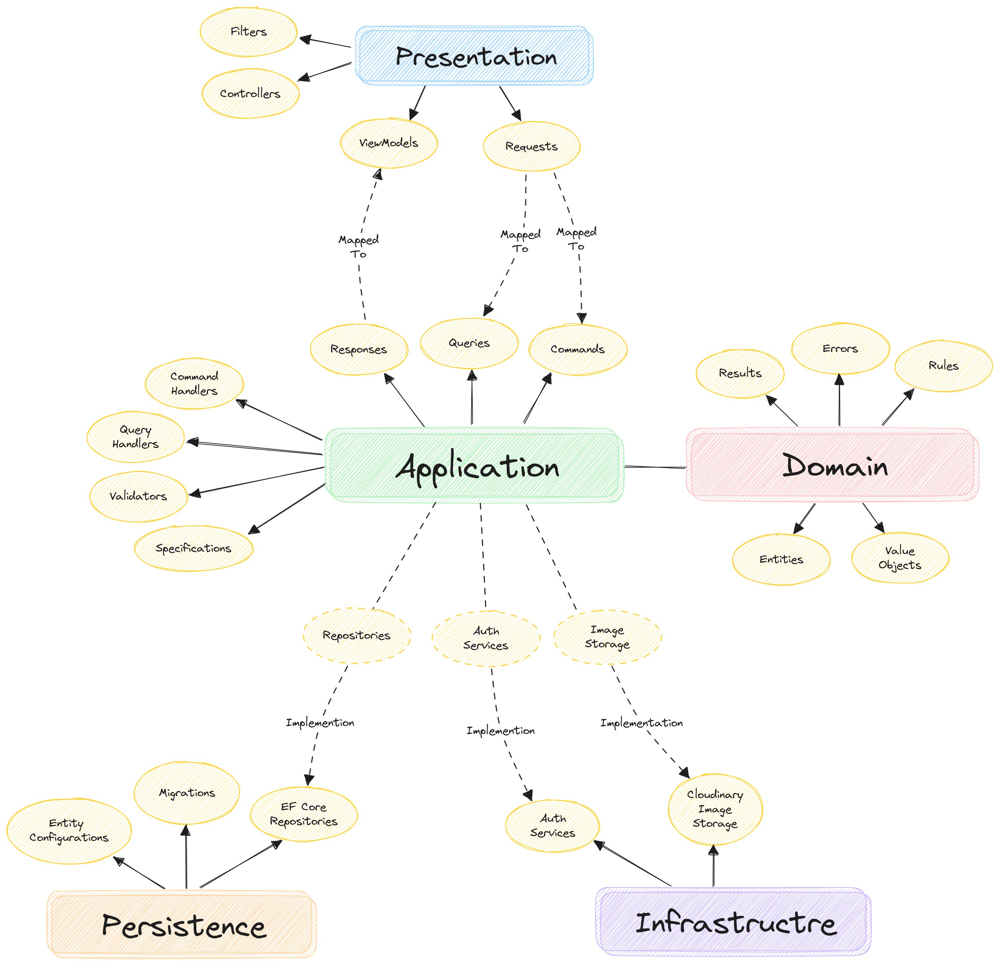

# Travel and Accommodation Booking Platform

[](https://github.com/DotNetBackendTraining/travel-and-accommodation-booking-platform/actions/workflows/build-test-push.yml)

## Overview

This is an ASP.NET Core API project for an advanced online hotel booking system. Which includes the Login Page, Home
Page, Search Results, Hotel Details, Secure Checkout, and Admin Management.

## Table of Contents

1. [Overview](#overview)
2. [Project Requirements](#project-requirements)
3. [Domain Models](#domain-models)
4. [Project Architecture](#project-architecture)
    1. [Structure & Dependencies](#structure--dependencies)
    2. [Presentation Layer](#presentation-layer)
    3. [Application Layer](#application-layer)
    4. [Domain Layer](#domain-layer)
    5. [Persistence Layer](#persistence-layer)
    6. [Infrastructure Layer](#infrastructure-layer)
5. [Getting Started](#getting-started)
    1. [Setup](#setup)
    2. [Running](#running)
    3. [Postman Collection](#postman-collection)

## Project Requirements

To understand the project requirements in detail, please refer to
the [Project Requirements documentation](documentations/ProjectRequirements.md).

## Domain Models

The domain models used in this project were derived from the project requirements to reflect the business logic
accurately.
To view the detailed domain models, please refer to the [Domain Models documentation](documentations/DomainModels.md).

## Project Architecture

This project is designed using the **Clean Architecture**.
Here is an overview of the architecture of the project:



### Structure & Dependencies

- The `App` project serves as the entry point of the application and is responsible for configuring all the necessary
  services, dependency injections, and application settings.
  It depends on all projects and that's why it was separated from the Presentation layer.
- The **Application Layer** is the core of the system and **does not depend on any other layers**. It contains the
  business logic, commands, queries, and validation logic that drive the system.
- The **Presentation, Persistence, and Infrastructure layers** are structured to depend only on the Application layer
  and never on each other. This isolation ensures that changes in one layer (e.g., switching the database in the
  Persistence layer or changing the UI framework in the Presentation layer) do not affect the others.

### Presentation Layer

- **Controllers**: All endpoints should be defined here.
- **Filters**: All filters should be defined here, including swagger filters.
- **ViewModels**: Application response objects should be mapped to ViewModels when complex UI model is required.
- **Requests**: Complex application request objects can be created and mapped from Requests objects.

### **Application Layer**

- **Commands**: All business logic commands.
- **Queries**: All business logic queries.
- **Responses**: Models that are returned from Command & Query Handlers.
- **Command Handlers**: Orchestrate command logic, including error handling and calling repositories or services.
- **Query Handlers**: Orchestrate query logic, including error handling and calling specifications and repositories.
- **Validators**: Fluent validators that ensures Commands & Queries always receive valid requests.
- **Specifications**: Adralis Specifications which are fine-grained query logic pieces sent to generic repositories.

### **Domain Layer**

- **Entities**: Core objects of the system representing the main business concepts.
- **Value Objects**: Objects with unique attributes structure but do not have unique identity.
  They are part of other domain entities.
- **Rules**: Domain rules have general constants which application services and entity configurations in persistence
  layer should follow.
- **Result**: A unified result object which all services and request handlers should return.
- **Errors**: Domain error constants which application services and handlers can return for failure results.

### **Persistence Layer**

- **Entity Configurations**: How entities are mapped to database schema. Defined by EF Core.
- **Migrations**: All migrations should be in the persistence layer.
- **EF Core Repositories**: Generic repositories that take specifications and perform simple functions using DbContext.

### **Infrastructure Layer**

- **Auth Services**: Authentication related services should be in the infrastructure.
- **Cloudinary Image Storage**: Application Image Storage is implemented with Cloudinary in the Infrastructure.

## Getting Started

### Setup

Before running the project, you need to configure the application settings.
Add the following `appsettings.json` in the `TravelAccommodationBookingPlatform.App` project:
(You can find these values in the Jira project site)

```json
{
  "CloudinarySettings": {
    "CloudName": "...",
    "ApiKey": "...",
    "ApiSecret": "..."
  }
}
```

### Running

The project uses docker-compose which includes a SQL Server image, so no need to install it locally.
Use the following command to run docker-compose:

```bash
docker-compose up
```

### Postman Collection

1. **Import into Postman**: Json file is located at [postman_collection.json](documentations/postman_collection.json)
2. **Configure Environment Variables**:
    - **baseURL**: For example to `localhost:8080`
    - **bearerToken**: Generate it from `users/token` endpoint. Use the user or admin examples as you need.