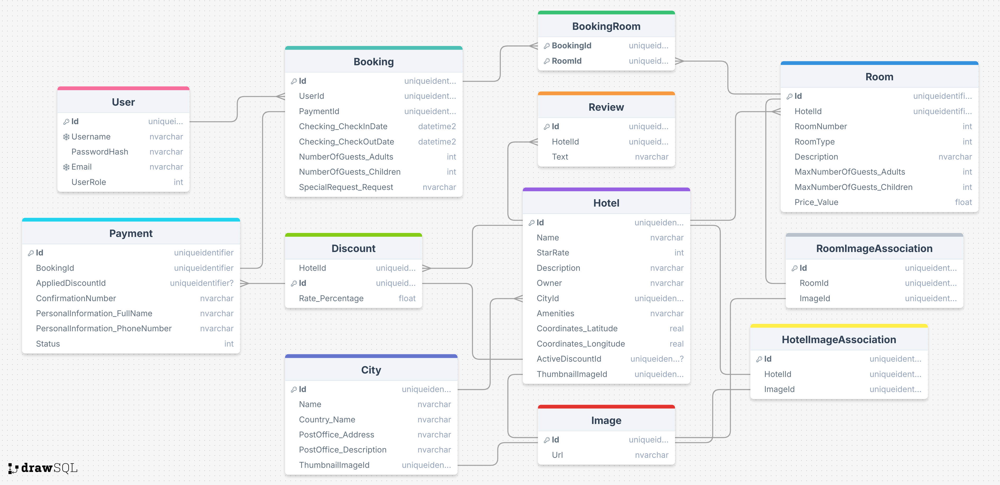

# Domain Models

This page includes the details for each domain model and where in the requirements is each field inferred from.
Before that, here is a class diagram that summarizes the domain models and their relationships:

## User

- **Username**
- **Password Hash**
- **Email** (to receive invoices - 5.2)
- **Role**
- **Collection of Bookings** {N Users with M Bookings}
- **[History]** (derived from the bookings - 2.3)

## Hotel

- **Name**
- **Star Rate**
- **Description** (for the hotel page - 4.2)
- **Owner**
- **Thumbnail Image** (2.2)
- **[Number of Rooms (of Type)]** (derived from Rooms)
- **Collection of Rooms** {1 Hotel has N Rooms}
- **City**
- **Coordinates**
    - **Latitude**
    - **Longitude**
- **Collection of Reviews**
- **Collection of Images** (gallery - 4.1)
- **Collection of Amenities** (to search by - 3.1)
- **Collection of Discounts** {1 Hotel has N Discounts}
- **Active Discount** (optional) {1 Hotel has a single active Discount}

## City

- **Name**
- **Country**
- **Post Office**
- **Thumbnail** (optional - implied by 2.4.1)
- **Collection of Hotels** {1 City has N Hotels}
- **[Number of Hotels]** (derived from hotels collection)

## Room

- **Hotel** {1 Room is for 1 Hotel}
- **Room Number**
- **Type** (like luxury, budget, or boutique - 3.1)
- **Description** (for the hotel page - 4.3)
- **Price** (per night - 3.2)
- **[Availability]** (derived from the Bookings)
- **Collection of Bookings** {1 Booking is for 1 User}
- **Maximum Number of Guests** (to search by - 2.1)
    - **Adults**
    - **Children**
- **Collection of Images** (4.3)

## Booking

- **User** {1 Booking has 1 User}
- **Collection of Rooms** {1 Booking has N Rooms} (implied by 2.1.4)
- **Check In Date** (default is today - 2.1)
- **Check Out Date** (default is tomorrow - 2.1)
- **Number of Guests**
    - **Adults**
    - **Children**
    - Requirements are not clear, so the simplest approach is assumed: each of these should be less or equal to the
      respective sum of all rooms. For example, R1{2, 2} + R2{1, 3} can fit a booking of number of guests {3, 5}.
- **Special Requests**
- **Payment** {1 Booking has 0 or 1 Payment}

## Payment

- **Booking** {1 Payment is for 1 Booking}
- **Personal Information**
- **[Total Price]** (derived from Rooms prices and Applied Discount)
- **Applied Discount** {1 Payment has 0 or 1 Discount}
- **Confirmation Number**
- **Payment Status**

## Discount

- **Hotel** {1 Discount is for 1 Hotel}
- **Discount Rate**
- Requirements are not clear, so the simplest (working) design is assumed for now:
    - A single active discount at a time (held by the Hotel entity)
    - It is applied to all rooms in the hotel.
    - It is a fixed rate (percentage) applied on the original price.
